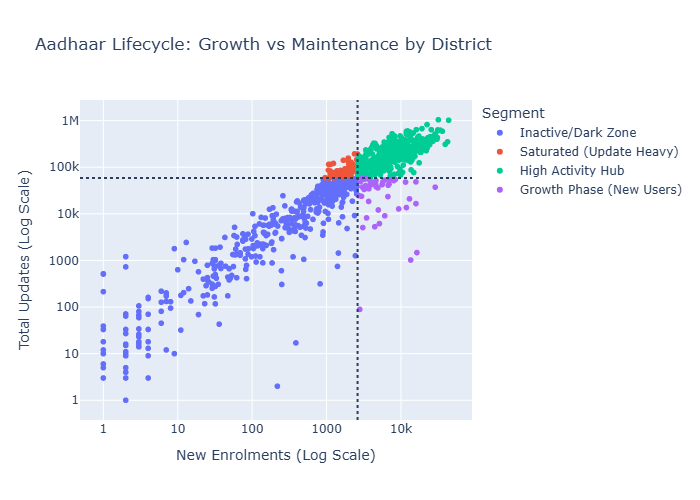
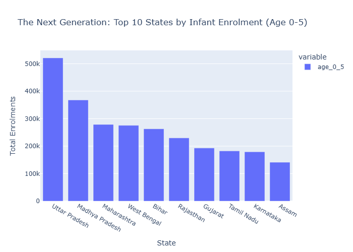
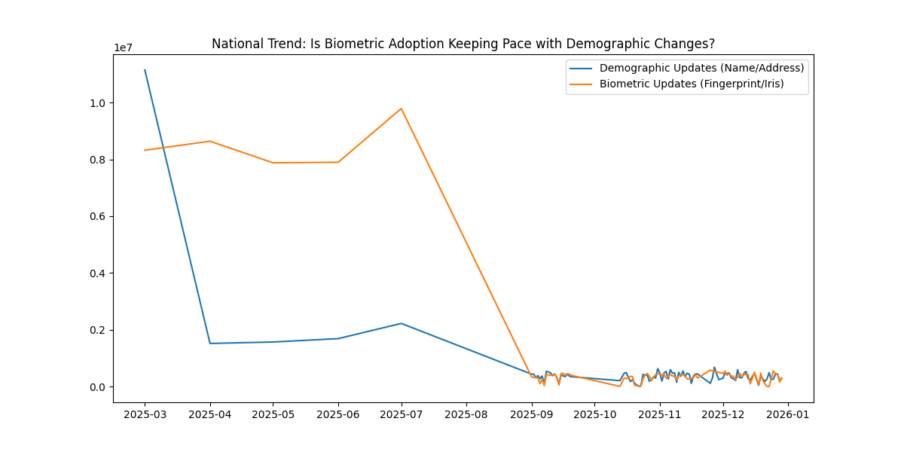
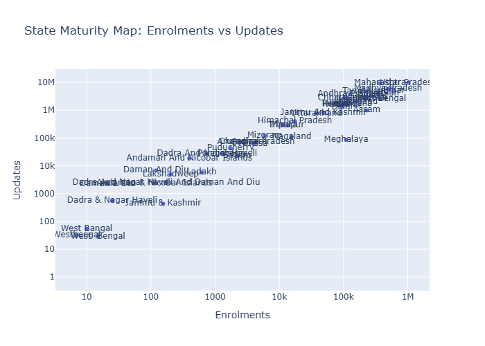
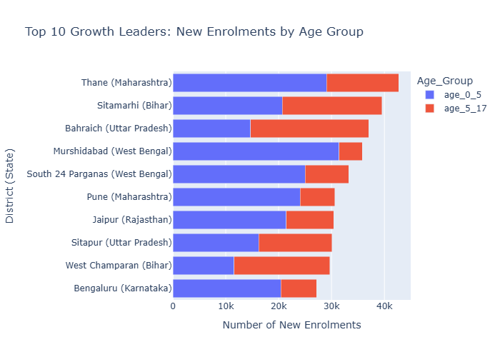

# 🆔 Aadhaar Lifecycle Management: Growth vs. Maintenance

This project was developed for the **UIDAI Data Hackathon**, focusing on the strategic transformation of Aadhaar from an "Enrolment-first" system to an "Identity Lifecycle Management" model. By analyzing over **5 million transaction records**, we've developed a roadmap for infrastructure optimization and security compliance.

## 🚀 The Approach: The "Maturity Index"
The core philosophy of this analysis is that India is in two development phases simultaneously. We categorize districts and states based on an **Efficiency Score** (Updates vs. New Enrolments):
- **Growth Markets**: High new enrolments, needing more physical kits.
- **Mature Markets**: High update volume, needing digital kiosks and online service portals.

---

## 🔍 Key Insights & Pillars

### 1. The Security Vulnerability (Biometric Lag)
We identified a significant "Security Lag" in mandatory biometric updates for children (ages 5-17). While parents update names and addresses (Demographic), they often skip biometrics.
- **Impact**: IDs are being modified without verifying physical identity.
- **Recommendation**: Launch "School-Based Biometric Camps" in identified high-lag districts.

### 2. Infrastructure Optimization (Maturity Mapping)
Using a 2x2 matrix, we segmented districts into:
- **High Activity Hubs**: Balanced growth and maintenance.
- **Saturated Zones**: Mature markets ready for Digital-Self-Service.
- **Growth Phases**: New citizen acquisition zones.
- **Dark Zones**: Inactive regions needing investigation.

### 3. Eradicating Service Deserts
By drilling down to **Pincode-level** activity, we pinpointed exact geographical clusters with near-zero service reachable despite population density.
- **Solution**: Targeted deployment of Mobile Aadhaar Vans using these "Dark Zone" GPS coordinates.

---

## 🛠️ Project Structure
- `notebooks/data_hack.ipynb`: The original interactive analysis with detailed markdown and observations.
- `notebooks/data_hack.py`: A high-performance production script optimized for local execution and static image generation.
- `data/`: Folder for datasets (see `data/README.md` for download links).
- `output/`: Automatically generated charts and tables in PNG/HTML format.

---

## 📊 Visualizations Generated

The system automatically generates the following strategic charts in the `output/` directory:

### 1. Aadhaar Lifecycle: Growth vs. Maintenance
This 2x2 matrix segments every district into Hubs, Saturated, Growth, or Inactive zones.


### 2. Infant Enrolment (Age 0-5)
Mapping the registration gap for newborns to ensure the "Next Generation" is captured early.


### 3. National Update Trends
Comparing Demographic vs. Biometric update adoption rates over time.


### 4. State Maturity Map
Visualizing the ratio of Updates-to-Enrolments to determine state-level infrastructure needs.


### 5. Growth Leaders by Age Group
Drilling down into the top 10 districts by their specific age-wise enrolment distribution.


---

## 🚦 How to Run
1. **Install Dependencies**:
   ```bash
   pip install -r requirements.txt
   ```
2. **Setup Data**:
   Follow the instructions in [`data/README.md`](data/README.md) to download and extract the required CSVs into the `data/` folder.
3. **Execute Analysis**:
   ```bash
   python notebooks/data_hack.py
   ```

---

## 🏆 Conclusion
Aadhaar is no longer just about giving an identity; it’s about managing that identity’s lifecycle. This data-driven policy roadmap allows UIDAI to move from a **reactive** model to a **proactive, citizen-centric service delivery** model.
